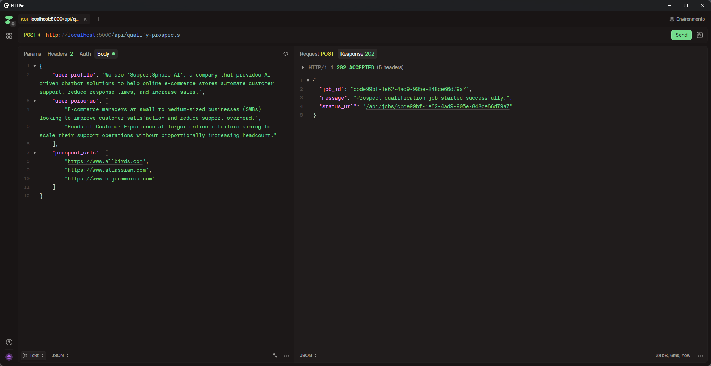
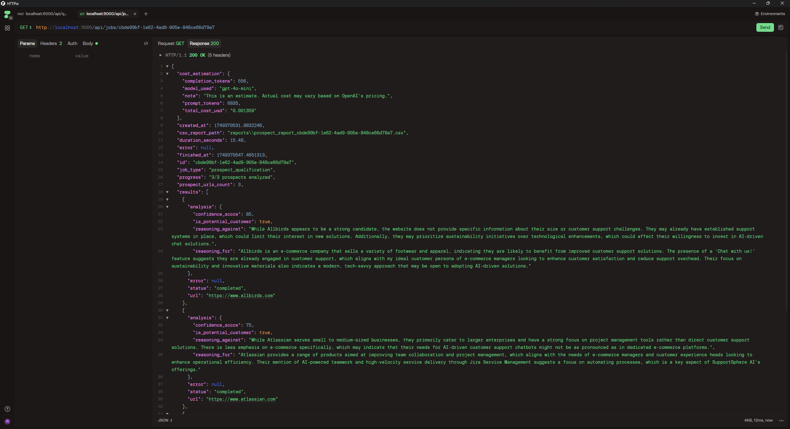

# Grand Spider 🕷️


**A powerful AI-driven web analysis and prospect qualification platform that combines intelligent web crawling with OpenAI's GPT models to provide comprehensive company analysis and B2B prospect qualification.**

## 🚀 Overview

Grand Spider is a sophisticated Flask-based API service that offers two main capabilities:

1. **Company Analysis**: Crawls websites (with JavaScript support via Selenium), analyzes individual pages using AI, and generates comprehensive company summaries
2. **Prospect Qualification**: Analyzes prospect websites against your business profile and ideal customer personas to identify potential customers with confidence scoring

## ✨ Key Features

### 🏢 Company Analysis
- **Intelligent Web Crawling**: Support for both simple HTTP requests and JavaScript-heavy sites via Selenium
- **AI-Powered Page Analysis**: Individual page analysis using OpenAI's GPT-4o-mini
- **Comprehensive Summarization**: Company-wide insights from multiple page analyses
- **Domain-Focused Crawling**: Stays within the target domain for relevant analysis

### 🎯 Prospect Qualification  
- **AI-Driven Matching**: Analyzes prospects against your business profile and customer personas
- **Confidence Scoring**: 0-100 confidence scores for qualification decisions
- **Detailed Reasoning**: Clear explanations for qualification decisions (both positive and negative)
- **Batch Processing**: Qualify multiple prospects in a single job
- **CSV Report Generation**: Downloadable reports for further analysis
- **Cost Estimation**: Real-time OpenAI API cost tracking

### 🔧 Technical Features
- **Async Job Processing**: Background processing with real-time status updates
- **Thread-Safe Operations**: Concurrent job handling with proper synchronization
- **Comprehensive Error Handling**: Robust error management and logging
- **API Authentication**: Secure endpoints with API key authentication
- **Health Monitoring**: System health checks and service status
- **Flexible Configuration**: Environment-based configuration management

## 🛠️ Technology Stack

- **Backend**: Python 3.x, Flask
- **AI Integration**: OpenAI GPT-4o-mini API
- **Web Scraping**: Requests, BeautifulSoup4, Selenium WebDriver
- **Data Processing**: CSV generation, JSON handling
- **Security**: API key authentication, input validation
- **Deployment**: Multi-platform support (Windows, Linux, macOS)

## 📦 Installation & Setup

### Prerequisites
- Python 3.8+
- Chrome browser (for Selenium features)
- OpenAI API key
- Git

### 1. Clone Repository
```bash
git clone https://github.com/yourusername/Grand_spider.git
cd Grand_spider
```

### 2. Create Virtual Environment
```bash
python -m venv venv

# Windows
venv\Scripts\activate

# macOS/Linux
source venv/bin/activate
```

### 3. Install Dependencies
```bash
pip install flask openai requests python-dotenv beautifulsoup4 selenium webdriver-manager
```

### 4. Environment Configuration
Create a `.env` file in the project root:
```env
SERVICE_API_KEY=your_secure_api_key_here
OPENAI_API_KEY=your_openai_api_key_here
```

### 5. Start the Service
```bash
python grand_spider.py
```

The API will be available at `http://localhost:5000`

## 📚 API Documentation

### 🏥 Health Check
**GET** `/api/health`

Check service status and configuration.

```json
{
  "status": "ok",
  "message": "API is running",
  "service_api_key_status": "configured",
  "openai_client_status": "initialized",
  "selenium_support": "available"
}
```

### 🏢 Company Analysis
**POST** `/api/analyze-company`

Analyze a company's website comprehensively.

**Headers:**
- `Content-Type: application/json`
- `api-key: your_service_api_key`

**Request Body:**
```json
{
  "url": "https://example.com",
  "max_pages": 10,
  "use_selenium": false
}
```

**Response:**
```json
{
  "message": "Company analysis job started successfully.",
  "job_id": "abc123-def456-789",
  "status_url": "/api/jobs/abc123-def456-789"
}
```

### 🎯 Prospect Qualification
**POST** `/api/qualify-prospects`

Qualify multiple prospects against your business criteria.

**Headers:**
- `Content-Type: application/json`
- `api-key: your_service_api_key`

**Request Example:**



**Response Example:**



**Request Body:**
```json
{
  "user_profile": "We are SupportSphere AI, a company that provides AI-driven chatbot solutions to help online e-commerce stores automate customer support, reduce response times, and increase sales.",
  "user_personas": [
    "E-commerce managers at small to medium-sized businesses (SMBs) looking to improve customer satisfaction and reduce support overhead.",
    "Heads of Customer Experience at larger online retailers aiming to scale their support operations without proportionally increasing headcount."
  ],
  "prospect_urls": [
    "https://www.allbirds.com",
    "https://www.atlassian.com",
    "https://www.bigcommerce.com"
  ]
}
```

### 📊 Job Status & Management
**GET** `/api/jobs/{job_id}`

Get detailed status and results for any job.

**GET** `/api/jobs`

List all submitted jobs with summary information.

## 🎮 Testing with Postman

Import the provided Postman collection (`Grand_Spider_Postman_Collection.json`) for easy testing:

1. Import the collection file into Postman
2. Set collection variables:
   - `baseUrl`: `http://localhost:5000`
   - `apiKey`: Your SERVICE_API_KEY value
3. Run requests in sequence:
   - Health Check → Start Job → Monitor Status → View Results

## 📊 Cost Management

Grand Spider provides real-time cost estimation for OpenAI API usage:

```json
{
  "cost_estimation": {
    "total_cost_usd": "0.012450",
    "prompt_tokens": 15420,
    "completion_tokens": 3890,
    "model_used": "gpt-4o-mini",
    "note": "This is an estimate. Actual cost may vary based on OpenAI's pricing."
  }
}
```

## 📁 Output & Reports

### CSV Reports
Prospect qualification jobs automatically generate CSV reports:
- **Location**: `reports/prospect_report_{job_id}.csv`
- **Contains**: URLs, qualification status, confidence scores, reasoning

### JSON Responses
All job results are available via API in structured JSON format with detailed analysis results.

## ⚙️ Configuration Options

Customize behavior via environment variables:

```env
# Required
SERVICE_API_KEY=your_api_key
OPENAI_API_KEY=your_openai_key

# Optional Customization
REQUEST_TIMEOUT=15
SELENIUM_TIMEOUT=20
MAX_CONTENT_LENGTH=15000
OPENAI_MODEL=gpt-4o-mini
MAX_RESPONSE_TOKENS_PAGE=300
MAX_RESPONSE_TOKENS_SUMMARY=500
MAX_RESPONSE_TOKENS_PROSPECT=800
```

## 🚀 Production Deployment

### Using Gunicorn (Linux/macOS)
```bash
pip install gunicorn
gunicorn -w 4 -b 0.0.0.0:5000 grand_spider:app
```

### Using Waitress (Windows)
```bash
pip install waitress
waitress-serve --host=0.0.0.0 --port=5000 grand_spider:app
```

### Docker Deployment
```dockerfile
FROM python:3.9-slim

WORKDIR /app
COPY requirements.txt .
RUN pip install -r requirements.txt

# Install Chrome for Selenium
RUN apt-get update && apt-get install -y \
    wget gnupg unzip && \
    wget -q -O - https://dl.google.com/linux/linux_signing_key.pub | apt-key add - && \
    echo "deb [arch=amd64] http://dl.google.com/linux/chrome/deb/ stable main" >> /etc/apt/sources.list.d/google-chrome.list && \
    apt-get update && apt-get install -y google-chrome-stable

COPY . .
EXPOSE 5000
CMD ["python", "grand_spider.py"]
```

## 🔒 Security Considerations

- **API Key Authentication**: All endpoints require valid API keys
- **Input Validation**: Comprehensive request validation and sanitization
- **Rate Limiting**: Consider implementing rate limiting for production use
- **HTTPS**: Use HTTPS in production environments
- **Environment Variables**: Never commit API keys to version control

## 🐛 Troubleshooting

### Common Issues

**401 Unauthorized**
- Verify `api-key` header matches `SERVICE_API_KEY`
- Check for typos in environment variables

**503 Service Unavailable**
- Verify OpenAI API key is valid and has credits
- Check internet connectivity

**Selenium Issues**
- Ensure Chrome browser is installed
- Check that ChromeDriver is accessible
- Verify sufficient system resources

### Logging
Enable detailed logging by checking the console output. All operations are logged with timestamps and thread information.

## 📈 Update History

### Version 2.0.0 (Latest)
**🎯 Major Feature Addition: Prospect Qualification System**
- ✅ Added AI-powered prospect qualification against business profiles
- ✅ Implemented customer persona matching with confidence scoring
- ✅ Added CSV report generation for qualification results
- ✅ Implemented real-time cost estimation for OpenAI API usage
- ✅ Enhanced job management system to support multiple job types
- ✅ Added batch processing capabilities for multiple prospects
- ✅ Improved error handling and validation
- ✅ Enhanced API documentation with visual examples

### Version 1.1.0
**🚀 Enhanced Web Crawling Capabilities**
- ✅ Added Selenium WebDriver support for JavaScript-heavy websites
- ✅ Implemented intelligent crawler selection (simple vs. Selenium)
- ✅ Enhanced content extraction with BeautifulSoup4
- ✅ Added comprehensive error handling for web crawling
- ✅ Improved logging and monitoring capabilities

### Version 1.0.0
**🎉 Initial Release: Company Analysis System**
- ✅ Core company website analysis functionality
- ✅ OpenAI GPT integration for content analysis
- ✅ REST API with Flask framework
- ✅ Basic web crawling with domain restrictions
- ✅ Job-based processing with status tracking
- ✅ API key authentication system

## 🤝 Contributing

1. Fork the repository
2. Create your feature branch (`git checkout -b feature/AmazingFeature`)
3. Commit your changes (`git commit -m 'Add some AmazingFeature'`)
4. Push to the branch (`git push origin feature/AmazingFeature`)
5. Open a Pull Request

## 📄 License

This project is licensed under the MIT License - see the [LICENSE](LICENSE) file for details.

## 🙏 Acknowledgments

- OpenAI for providing powerful language models
- Selenium WebDriver team for browser automation capabilities
- Flask community for the excellent web framework
- All contributors and users of Grand Spider

## 📞 Support

For support, feature requests, or bug reports:
- 📧 Email: [your-email@domain.com]
- 🐛 Issues: [GitHub Issues](https://github.com/yourusername/Grand_spider/issues)
- 📖 Documentation: [GitHub Wiki](https://github.com/yourusername/Grand_spider/wiki)

---

**Made with ❤️ by the Grand Spider Team**

*Empowering businesses with AI-driven web intelligence and prospect qualification.*

